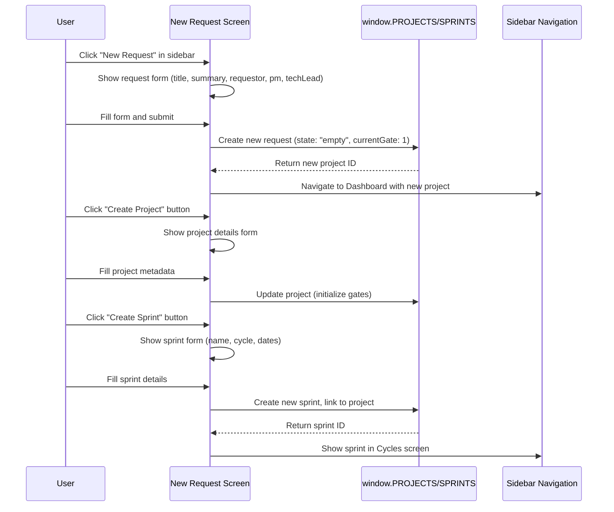

# Design Document: create-request-project-sprint

## Overview

This feature enables users to create new requests, projects, and sprints within the ALPS application. The workflow follows a three-step progression: (1) create a new request with business context, (2) convert that request into a project with gate structure, and (3) create sprints within the project for iterative delivery. The design integrates with the existing 3-gate model, data layer, and sidebar navigation.

## Main Workflow



## Core Interfaces/Types

```javascript
// Request/Project creation form data
interface CreateProjectInput {
  title: string              // Project title (required, 3-100 chars)
  summary: string            // Project summary (required, 10-500 chars)
  requestor: string          // PEOPLE key (required)
  pm: string                 // PEOPLE key (required)
  techLead: string           // PEOPLE key (required)
  targetDelivery: string     // ISO date "YYYY-MM-DD" (required)
  tags: string[]             // Optional tags (max 5)
  dependencies: string[]     // Optional dependency descriptions
}

// Sprint creation form data
interface CreateSprintInput {
  name: string               // Sprint name (required, 3-50 chars)
  description: string        // Sprint description (optional, max 300 chars)
  projectId: string          // Parent project ID (required)
  cycle: string              // Cycle name, e.g. "Q2 2026" (required)
  startDate: string          // ISO date "YYYY-MM-DD" (required)
  endDate: string            // ISO date "YYYY-MM-DD" (required, must be > startDate)
}

// Validation result
interface ValidationResult {
  isValid: boolean
  errors: { [fieldName: string]: string }  // Field-level error messages
}

// Form state
interface FormState {
  values: CreateProjectInput | CreateSprintInput
  touched: { [fieldName: string]: boolean }
  errors: { [fieldName: string]: string }
  isSubmitting: boolean
  submitError: string | null
}
```

## Key Functions with Formal Specifications

### Function 1: validateProjectInput()

```javascript
function validateProjectInput(input: CreateProjectInput): ValidationResult
```

**Preconditions:**
- `input` is a non-null object
- `input.title`, `input.summary`, `input.requestor`, `input.pm`, `input.techLead`, `input.targetDelivery` are defined
- `input.tags` and `input.dependencies` are arrays (may be empty)

**Postconditions:**
- Returns `ValidationResult` object
- If `isValid === true`: all fields pass validation rules
- If `isValid === false`: `errors` object contains at least one error message
- No mutations to input object

**Validation Rules:**
- `title`: non-empty, 3-100 characters, no leading/trailing whitespace
- `summary`: non-empty, 10-500 characters
- `requestor`, `pm`, `techLead`: must exist as keys in `window.PEOPLE`
- `targetDelivery`: valid ISO date string, must be >= today
- `tags`: array of strings, max 5 items, each 1-20 characters
- `dependencies`: array of strings, max 10 items, each 1-100 characters

**Loop Invariants:** N/A (no loops)

### Function 2: validateSprintInput()

```javascript
function validateSprintInput(input: CreateSprintInput): ValidationResult
```

**Preconditions:**
- `input` is a non-null object
- `input.name`, `input.projectId`, `input.cycle`, `input.startDate`, `input.endDate` are defined
- `input.description` is optional string
- `window.PROJECTS` contains project with id matching `input.projectId`

**Postconditions:**
- Returns `ValidationResult` object
- If `isValid === true`: all fields pass validation rules
- If `isValid === false`: `errors` object contains at least one error message
- No mutations to input object

**Validation Rules:**
- `name`: non-empty, 3-50 characters, no leading/trailing whitespace
- `description`: optional, if provided: 0-300 characters
- `projectId`: must exist in `window.PROJECTS`
- `cycle`: non-empty, 1-30 characters (e.g., "Q2 2026")
- `startDate`: valid ISO date string
- `endDate`: valid ISO date string, must be > `startDate`
- Date range: `endDate - startDate` must be 1-90 days

**Loop Invariants:** N/A (no loops)

### Function 3: createProject()

```javascript
function createProject(input: CreateProjectInput): { success: boolean, projectId?: string, error?: string }
```

**Preconditions:**
- `validateProjectInput(input).isValid === true`
- `window.PROJECTS` is an array
- All referenced PEOPLE keys exist in `window.PEOPLE`

**Postconditions:**
- If successful: new project object added to `window.PROJECTS`, returns `{ success: true, projectId }`
- If error: `window.PROJECTS` unchanged, returns `{ success: false, error: "message" }`
- New project has:
  - Unique `id` (format: "ALPS-{nextNumber}")
  - `state: "empty"` (drafting state)
  - `currentGate: 1` (business gate is first)
  - `gates` object with all three gates initialized to `{ status: "locked", completeness: 0, checklist: [] }`
  - `changeLog` entry recording creation
  - `completedTickets: 0`, `totalTickets: 0`
  - `blockers: 0`

**Side Effects:**
- Modifies `window.PROJECTS` array
- Does NOT persist to backend (in-memory only for prototype)

### Function 4: createSprint()

```javascript
function createSprint(input: CreateSprintInput): { success: boolean, sprintId?: string, error?: string }
```

**Preconditions:**
- `validateSprintInput(input).isValid === true`
- Project with `input.projectId` exists in `window.PROJECTS`
- `window.SPRINTS` is an array

**Postconditions:**
- If successful: new sprint object added to `window.SPRINTS`, project's `sprintIds` updated, returns `{ success: true, sprintId }`
- If error: `window.SPRINTS` and project unchanged, returns `{ success: false, error: "message" }`
- New sprint has:
  - Unique `id` (format: "sprint-{timestamp}")
  - `status: "planned"` (initial status)
  - `completedTickets: 0`, `totalTickets: 0`
  - All input fields copied to sprint object

**Side Effects:**
- Modifies `window.SPRINTS` array
- Modifies parent project's `sprintIds` array
- Does NOT persist to backend (in-memory only for prototype)

### Function 5: useFormState()

```javascript
function useFormState(initialValues: object): {
  values: object,
  touched: object,
  errors: object,
  isSubmitting: boolean,
  submitError: string | null,
  setFieldValue: (fieldName: string, value: any) => void,
  setFieldTouched: (fieldName: string, touched: boolean) => void,
  setSubmitting: (isSubmitting: boolean) => void,
  setSubmitError: (error: string | null) => void,
  resetForm: () => void
}
```

**Preconditions:**
- `initialValues` is a non-null object
- Component is mounted

**Postconditions:**
- Returns form state object with all methods
- `setFieldValue` updates `values[fieldName]` and clears error for that field
- `setFieldTouched` marks field as touched (shows validation errors)
- `resetForm` resets all state to initial values
- No side effects outside component

**Loop Invariants:** N/A (React hook)

## Algorithmic Pseudocode

### Main Request Creation Workflow

```pascal
ALGORITHM createRequestWorkflow(formInput)
INPUT: formInput of type CreateProjectInput
OUTPUT: result of type { success: boolean, projectId?: string, error?: string }

BEGIN
  // Step 1: Validate input
  validationResult ← validateProjectInput(formInput)
  
  IF NOT validationResult.isValid THEN
    RETURN { success: false, error: "Validation failed" }
  END IF
  
  // Step 2: Generate unique project ID
  nextNumber ← findMaxProjectNumber(window.PROJECTS) + 1
  projectId ← "ALPS-" + nextNumber
  
  // Step 3: Initialize gate structure
  gates ← {
    business: { status: "locked", completeness: 0, checklist: [] },
    product: { status: "locked", completeness: 0, checklist: [] },
    tech: { status: "locked", completeness: 0, checklist: [] }
  }
  
  // Step 4: Create project object
  newProject ← {
    id: projectId,
    title: formInput.title,
    summary: formInput.summary,
    requestor: formInput.requestor,
    pm: formInput.pm,
    techLead: formInput.techLead,
    submitted: today(),
    targetDelivery: formInput.targetDelivery,
    state: "empty",
    currentGate: 1,
    gates: gates,
    blockers: 0,
    dependencies: formInput.dependencies OR [],
    tags: formInput.tags OR [],
    changeLog: [{ gate: "business", date: today(), action: "created", by: currentUser, note: "Request created" }],
    ticketIds: [],
    sprintIds: [],
    completedTickets: 0,
    totalTickets: 0
  }
  
  // Step 5: Add to projects array
  window.PROJECTS.push(newProject)
  
  // Step 6: Return success
  RETURN { success: true, projectId: projectId }
END
```

**Preconditions:**
- formInput passes validation
- window.PROJECTS is initialized
- Current user is authenticated

**Postconditions:**
- New project added to window.PROJECTS
- Project ID is unique
- All gates initialized to locked state
- changeLog contains creation entry

**Loop Invariants:** N/A (no loops)

### Sprint Creation Workflow

```pascal
ALGORITHM createSprintWorkflow(formInput)
INPUT: formInput of type CreateSprintInput
OUTPUT: result of type { success: boolean, sprintId?: string, error?: string }

BEGIN
  // Step 1: Validate input
  validationResult ← validateSprintInput(formInput)
  
  IF NOT validationResult.isValid THEN
    RETURN { success: false, error: "Validation failed" }
  END IF
  
  // Step 2: Find parent project
  project ← findProjectById(window.PROJECTS, formInput.projectId)
  
  IF project IS NULL THEN
    RETURN { success: false, error: "Project not found" }
  END IF
  
  // Step 3: Generate unique sprint ID
  sprintId ← "sprint-" + generateTimestamp()
  
  // Step 4: Create sprint object
  newSprint ← {
    id: sprintId,
    name: formInput.name,
    description: formInput.description OR "",
    cycle: formInput.cycle,
    projectId: formInput.projectId,
    status: "planned",
    startDate: formInput.startDate,
    endDate: formInput.endDate,
    completedTickets: 0,
    totalTickets: 0
  }
  
  // Step 5: Add to sprints array
  window.SPRINTS.push(newSprint)
  
  // Step 6: Update project's sprintIds
  project.sprintIds.push(sprintId)
  
  // Step 7: Return success
  RETURN { success: true, sprintId: sprintId }
END
```

**Preconditions:**
- formInput passes validation
- Parent project exists in window.PROJECTS
- window.SPRINTS is initialized

**Postconditions:**
- New sprint added to window.SPRINTS
- Parent project's sprintIds updated
- Sprint ID is unique
- Sprint status is "planned"

**Loop Invariants:** N/A (no loops)

## Example Usage

```javascript
// Example 1: Create a new request
const requestInput = {
  title: "Mobile App Redesign",
  summary: "Modernize the mobile app UI/UX for iOS and Android",
  requestor: "asha",
  pm: "rina",
  techLead: "mateo",
  targetDelivery: "2026-09-30",
  tags: ["mobile", "design"],
  dependencies: ["Design System v3"]
};

const result = createProject(requestInput);
if (result.success) {
  console.log("Project created:", result.projectId);
  // Navigate to dashboard with new project
  setScreen("dashboard");
  setActiveProjectId(result.projectId);
}

// Example 2: Create a sprint within a project
const sprintInput = {
  name: "Sprint 1 — UI Components",
  description: "Build reusable component library for mobile app",
  projectId: "ALPS-303",
  cycle: "Q3 2026",
  startDate: "2026-07-01",
  endDate: "2026-07-14"
};

const sprintResult = createSprint(sprintInput);
if (sprintResult.success) {
  console.log("Sprint created:", sprintResult.sprintId);
  // Show sprint in Cycles screen
  setScreen("cycles");
}

// Example 3: Form validation
const input = { title: "AB", summary: "Short" };  // Invalid
const validation = validateProjectInput(input);
if (!validation.isValid) {
  console.log("Errors:", validation.errors);
  // { title: "Title must be at least 3 characters", summary: "Summary must be at least 10 characters" }
}

// Example 4: Using form state hook
function NewRequestForm() {
  const form = useFormState({
    title: "",
    summary: "",
    requestor: "asha",
    pm: "rina",
    techLead: "mateo",
    targetDelivery: "",
    tags: [],
    dependencies: []
  });

  const handleSubmit = async (e) => {
    e.preventDefault();
    form.setSubmitting(true);
    
    const result = createProject(form.values);
    if (result.success) {
      form.resetForm();
      setActiveProjectId(result.projectId);
    } else {
      form.setSubmitError(result.error);
    }
    
    form.setSubmitting(false);
  };

  return (
    <form onSubmit={handleSubmit}>
      <input
        value={form.values.title}
        onChange={(e) => form.setFieldValue("title", e.target.value)}
        onBlur={() => form.setFieldTouched("title", true)}
      />
      {form.touched.title && form.errors.title && (
        <span className="error">{form.errors.title}</span>
      )}
      {/* More fields... */}
      <button type="submit" disabled={form.isSubmitting}>
        Create Request
      </button>
    </form>
  );
}
```

## Component Structure

### NewRequestScreen

```javascript
function NewRequestScreen()
```

**Purpose**: Main screen for creating new requests. Displays a form with project metadata fields.

**Props**: None (uses global state from App)

**State**:
- `formState`: Form state object from `useFormState()`
- `step`: "request" | "project" | "sprint" (multi-step workflow)
- `createdProjectId`: ID of newly created project (for navigation)

**Responsibilities**:
- Render request creation form with validation
- Handle form submission via `createProject()`
- Navigate to dashboard after successful creation
- Show error messages for validation failures

### NewSprintForm

```javascript
function NewSprintForm({ projectId, onSuccess })
```

**Purpose**: Modal or inline form for creating a new sprint within a project.

**Props**:
- `projectId` (string): Parent project ID
- `onSuccess` (function): Callback after sprint creation

**State**:
- `formState`: Form state object from `useFormState()`

**Responsibilities**:
- Render sprint creation form with date picker
- Validate sprint input
- Call `createSprint()` on submit
- Trigger `onSuccess` callback after creation

### FormField

```javascript
function FormField({ label, name, type, value, error, touched, onChange, onBlur, required, placeholder })
```

**Purpose**: Reusable form input component with validation error display.

**Props**:
- `label` (string): Field label
- `name` (string): Field name (for form state)
- `type` (string): Input type ("text", "date", "select", etc.)
- `value` (any): Current field value
- `error` (string): Error message (if any)
- `touched` (boolean): Whether field has been interacted with
- `onChange` (function): Change handler
- `onBlur` (function): Blur handler
- `required` (boolean): Whether field is required
- `placeholder` (string): Placeholder text

**Responsibilities**:
- Render input element with appropriate type
- Show error message only if field is touched and has error
- Apply error styling (red border, error text color)
- Handle onChange and onBlur events

### DiscussionPanel

```javascript
function DiscussionPanel({ entityId, entityType, teamsThreadUrl, onTeamsThreadChange })
```

**Purpose**: Display and manage discussion threads for projects/sprints with optional MS Teams integration.

**Props**:
- `entityId` (string): Project or sprint ID
- `entityType` (string): "project" | "sprint"
- `teamsThreadUrl` (string): Optional MS Teams thread URL
- `onTeamsThreadChange` (function): Callback when Teams thread URL is updated

**State**:
- `messages`: Array of discussion messages
- `showTeamsInput`: Boolean to show Teams URL input field
- `teamsThreadInput`: Current Teams thread URL being edited

**Responsibilities**:
- Display threaded discussion messages
- Show "Open in Teams" button if Teams thread is linked
- Allow adding/editing Teams thread URL
- Display latest 3 messages in preview mode
- Expand to full thread view on click

## Data Model Updates

### PROJECTS array

New projects added to `window.PROJECTS` with structure:

```javascript
{
  id: "ALPS-{number}",           // Unique project ID
  title: string,                 // Project title
  summary: string,               // Project summary
  requestor: string,             // PEOPLE key
  pm: string,                    // PEOPLE key
  techLead: string,              // PEOPLE key
  submitted: "YYYY-MM-DD",       // Creation date
  targetDelivery: "YYYY-MM-DD",  // Target delivery date
  state: "empty" | "in_progress" | "blocked" | "done",
  currentGate: 1 | 2 | 3,        // Active gate number
  gates: {
    business: { status, completeness, checklist, ... },
    product: { status, completeness, checklist, ... },
    tech: { status, completeness, checklist, ... }
  },
  blockers: number,              // Count of blocked tickets
  dependencies: string[],        // Dependency descriptions
  tags: string[],                // Project tags
  changeLog: array,              // History of gate changes
  ticketIds: string[],           // Linked ticket IDs
  sprintIds: string[],           // Linked sprint IDs
  completedTickets: number,      // Count of completed tickets
  totalTickets: number           // Total ticket count
}
```

### SPRINTS array

New sprints added to `window.SPRINTS` with structure:

```javascript
{
  id: "sprint-{timestamp}",      // Unique sprint ID
  name: string,                  // Sprint name
  description: string,           // Sprint description (optional)
  cycle: string,                 // Cycle name (e.g., "Q2 2026")
  projectId: string,             // Parent project ID
  status: "planned" | "in_progress" | "completed",
  startDate: "YYYY-MM-DD",       // Sprint start date
  endDate: "YYYY-MM-DD",         // Sprint end date
  completedTickets: number,      // Count of completed tickets
  totalTickets: number,          // Total ticket count
  teamsThreadUrl: string,        // Optional MS Teams thread URL
  teamsThreadId: string          // Optional MS Teams thread ID
}
```

### DISCUSSION_THREAD object

Discussion threads stored in `window.DISCUSSION_THREAD`:

```javascript
{
  "project-{projectId}": [
    {
      id: string,                // Unique message ID
      author: string,            // PEOPLE key
      timestamp: "YYYY-MM-DDTHH:mm:ss",
      message: string,           // Discussion message
      replies: [...]             // Nested replies
    }
  ],
  "sprint-{sprintId}": [
    // Same structure as project discussions
  ]
}
```

## Navigation Flow

### From Sidebar

1. User clicks "New Request" in sidebar
2. App sets `screen = "new-request"`
3. `NewRequestScreen` renders
4. User fills form and submits
5. `createProject()` adds new project to `window.PROJECTS`
6. App navigates to dashboard: `setScreen("dashboard")` + `setActiveProjectId(newProjectId)`
7. Dashboard shows newly created project

### From Dashboard

1. User clicks "Create Sprint" button on project
2. Modal or inline form appears
3. User fills sprint details and submits
4. `createSprint()` adds new sprint to `window.SPRINTS`
5. App navigates to Cycles screen: `setScreen("cycles")`
6. Cycles screen shows newly created sprint

## Correctness Properties

### Property 1: Project Creation Idempotency

```javascript
// For any valid input, creating the same project twice results in two distinct projects
const input = { title: "Test", summary: "Test project", ... };
const result1 = createProject(input);
const result2 = createProject(input);

ASSERT result1.success === true
ASSERT result2.success === true
ASSERT result1.projectId !== result2.projectId
ASSERT window.PROJECTS.length === initialLength + 2
```

### Property 2: Sprint Belongs to Project

```javascript
// After creating a sprint, the sprint's projectId matches the parent project
const sprintInput = { projectId: "ALPS-218", ... };
const result = createSprint(sprintInput);

ASSERT result.success === true
const sprint = window.SPRINTS.find(s => s.id === result.sprintId);
ASSERT sprint.projectId === "ALPS-218"
ASSERT window.PROJECTS.find(p => p.id === "ALPS-218").sprintIds.includes(result.sprintId)
```

### Property 3: Validation Prevents Invalid Data

```javascript
// Invalid inputs are rejected before data modification
const invalidInput = { title: "AB", summary: "Short" };  // Too short
const result = createProject(invalidInput);

ASSERT result.success === false
ASSERT window.PROJECTS.length === initialLength  // No new project added
```

### Property 4: Date Range Validation

```javascript
// Sprint end date must be after start date
const sprintInput = {
  startDate: "2026-07-14",
  endDate: "2026-07-01",  // Before start date
  ...
};
const validation = validateSprintInput(sprintInput);

ASSERT validation.isValid === false
ASSERT validation.errors.endDate !== undefined
```

### Property 5: Project ID Uniqueness

```javascript
// Each created project has a unique ID
const input1 = { title: "Project 1", ... };
const input2 = { title: "Project 2", ... };
const result1 = createProject(input1);
const result2 = createProject(input2);

ASSERT result1.projectId !== result2.projectId
ASSERT window.PROJECTS.filter(p => p.id === result1.projectId).length === 1
ASSERT window.PROJECTS.filter(p => p.id === result2.projectId).length === 1
```

## Error Handling

### Validation Errors

**Condition**: User submits form with invalid data (e.g., title too short, invalid date)

**Response**: Form displays field-level error messages, submit button remains disabled

**Recovery**: User corrects field and resubmits

### Project Not Found

**Condition**: User tries to create sprint for non-existent project

**Response**: `createSprint()` returns `{ success: false, error: "Project not found" }`

**Recovery**: User selects valid project from dropdown

### Date Range Error

**Condition**: User enters sprint end date before start date

**Response**: Form shows error "End date must be after start date"

**Recovery**: User corrects date range

### Duplicate Project Title

**Condition**: User creates project with same title as existing project

**Response**: Creation succeeds (titles are not unique), but user sees warning in UI

**Recovery**: User can rename project in dashboard

## Testing Strategy

### Unit Testing Approach

- Test `validateProjectInput()` with valid/invalid inputs
- Test `validateSprintInput()` with valid/invalid date ranges
- Test `createProject()` adds project to array with correct structure
- Test `createSprint()` updates both sprint array and project's sprintIds
- Test `useFormState()` hook state transitions

### Property-Based Testing Approach

**Property Test Library**: fast-check (JavaScript)

- **Property 1**: For any valid project input, `createProject()` returns unique project ID
- **Property 2**: For any valid sprint input, sprint's projectId matches parent project
- **Property 3**: Invalid inputs never modify data structures
- **Property 4**: Date validation rejects end dates before start dates
- **Property 5**: Form state correctly tracks touched/error fields

### Integration Testing Approach

- Test full workflow: create request → navigate to dashboard → create sprint → view in cycles
- Test form submission with various role combinations
- Test navigation state after creation
- Test data persistence in window.PROJECTS and window.SPRINTS

## Performance Considerations

- Form validation runs on every field change (debounce if needed for large forms)
- Project ID generation uses simple counter (O(n) scan of existing projects)
- Sprint creation updates project's sprintIds array (O(1) push operation)
- No backend calls (in-memory prototype) — all operations are instant

## Security Considerations

- Validate all user inputs before adding to data structures
- Ensure requestor/pm/techLead are valid PEOPLE keys (prevent injection)
- Sanitize text fields (title, summary, description) to prevent XSS
- Validate dates are within reasonable range (prevent future dates > 10 years)
- No sensitive data in form (no passwords, API keys, etc.)

## Dependencies

- React 18 (useState, useEffect, useRef)
- window.PEOPLE (for validating person references)
- window.PROJECTS (for storing new projects)
- window.SPRINTS (for storing new sprints)
- window.Icon (for form UI icons)
- primitives.jsx (Button, Section, Avatar components)
